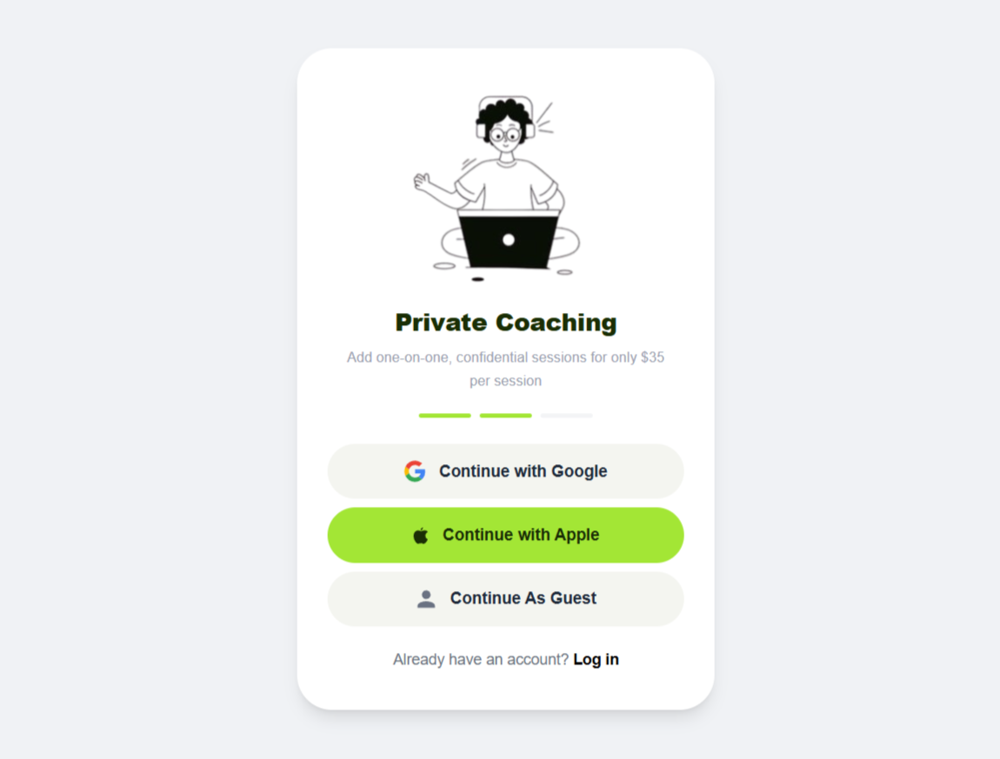
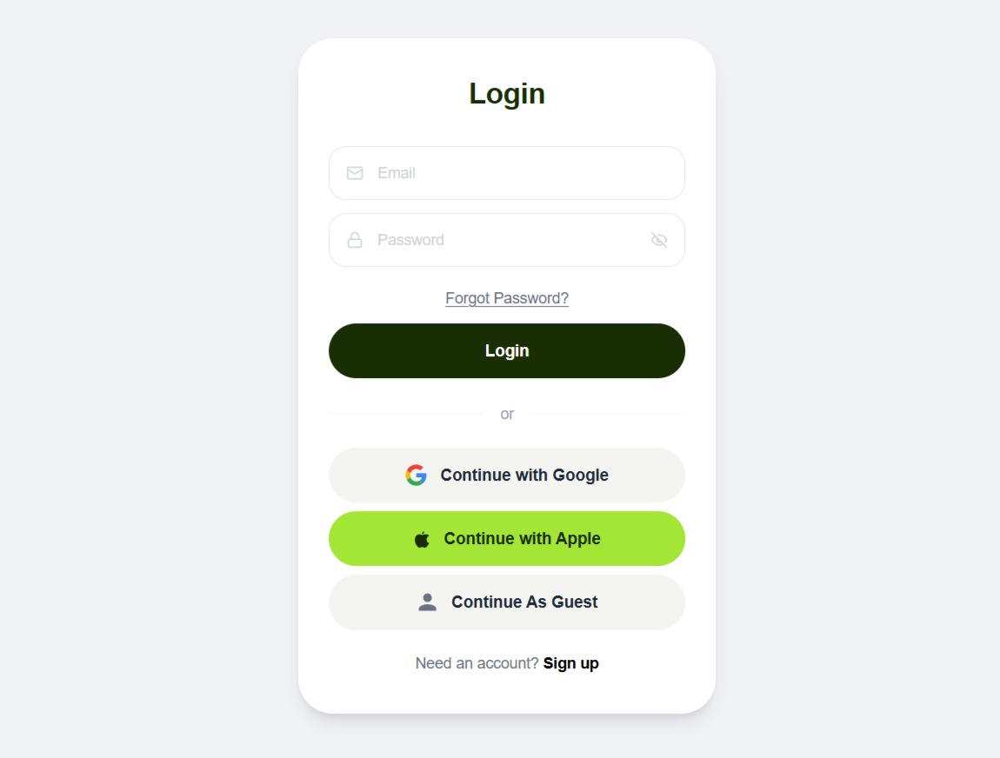

-----

# 🚀 ZephyraTech Frontend Assignment

### *Full Stack Developer Intern Selection Process*

A modern, high-performance, and responsive user interface built for the ZephyraTech internship selection process. This project demonstrates the implementation of a seamless user flow using **Next.js 14**, **Tailwind CSS**, and **TypeScript**.

-----

## 🔗 Project Links

  - **🌐 Frontend Repository:** [GitHub Repo](https://github.com/tharu-2003/Zephyratechtask-Frontend.git)
  - **⚙️ Backend Repository:** [GitHub Repo](https://github.com/tharu-2003/Zephyratechtask-Backend.git)
  - **🚀 Live Demo (Frontend):** [https://zephyratechtask-frontend.vercel.app/](https://zephyratechtask-frontend.vercel.app/)
  - **📡 Live API (Backend):** [https://zephyratechtask-backend.onrender.com](https://zephyratechtask-backend.onrender.com)

-----

## ✨ Features

  - **Onboarding Experience:** A polished welcome screen featuring custom illustrations and integrated social login options.
  - **Secure Authentication:** Fully functional login system integrated with a custom Express.js backend.
  - **Responsive Design:** Optimized for all devices (Mobile, Tablet, and Desktop) using Tailwind's mobile-first approach.
  - **Reusable Architecture:** Built with highly modular, reusable UI components (Buttons, Inputs, Modals).
  - **Strict Type Safety:** Developed with TypeScript to ensure code reliability and minimize runtime errors.
  - **Smooth Navigation:** Leverages the Next.js App Router for fast, client-side page transitions.

-----

## 🛠 Tech Stack

| Category | Technology |
| :--- | :--- |
| **Framework** | [Next.js 14 (App Router)](https://nextjs.org/) |
| **Styling** | [Tailwind CSS](https://tailwindcss.com/) |
| **Icons** | [Lucide React](https://lucide.dev/) |
| **HTTP Client** | [Axios](https://axios-http.com/) |
| **Language** | [TypeScript](https://www.google.com/search?q=https://www.typescriptlang.org/) |

-----

## 📸 Screenshots

| Onboarding Screen | Login Screen |
| :---: | :---: |
|  |  |

-----

## 📂 Project Structure

```text
src/
├── app/          # Next.js App Router (Pages, Layouts, and API routes)
├── components/   # Reusable UI components (Atomic design)
├── lib/          # Axios instance and API service configurations
├── public/       # Static assets, images, and brand illustrations
└── types/        # Global TypeScript definitions and interfaces
```

-----

## ⚙️ Installation & Setup

1.  **Clone the repository:**

    ```bash
    git clone https://github.com/tharu-2003/Zephyratechtask-Frontend.git
    cd Zephyratechtask-Frontend
    ```

2.  **Install dependencies:**

    ```bash
    npm install
    ```

3.  **Configure Environment Variables:**
    Create a `.env.local` file in the root directory and add your backend API URL:

    ```env
    NEXT_PUBLIC_API_URL=https://your-backend-api.onrender.com
    ```

4.  **Run the development server:**

    ```bash
    npm run dev
    ```

    Open [http://localhost:3000](https://www.google.com/search?q=http://localhost:3000) to see the result.

-----

## 🧑‍💻 Author

**Tharusha Sandaruwan**

  - **GitHub:** [@tharu-2003](https://www.google.com/search?q=https://github.com/tharu-2003)
  - **LinkedIn:** [Tharusha Sandaruwan](https://www.linkedin.com/in/tharusha-sandaruwan1/)

-----

Everything looks great\! Don't forget to add your **Vercel Live Demo link** in the Project Links section before you submit. Good luck\! 🚀